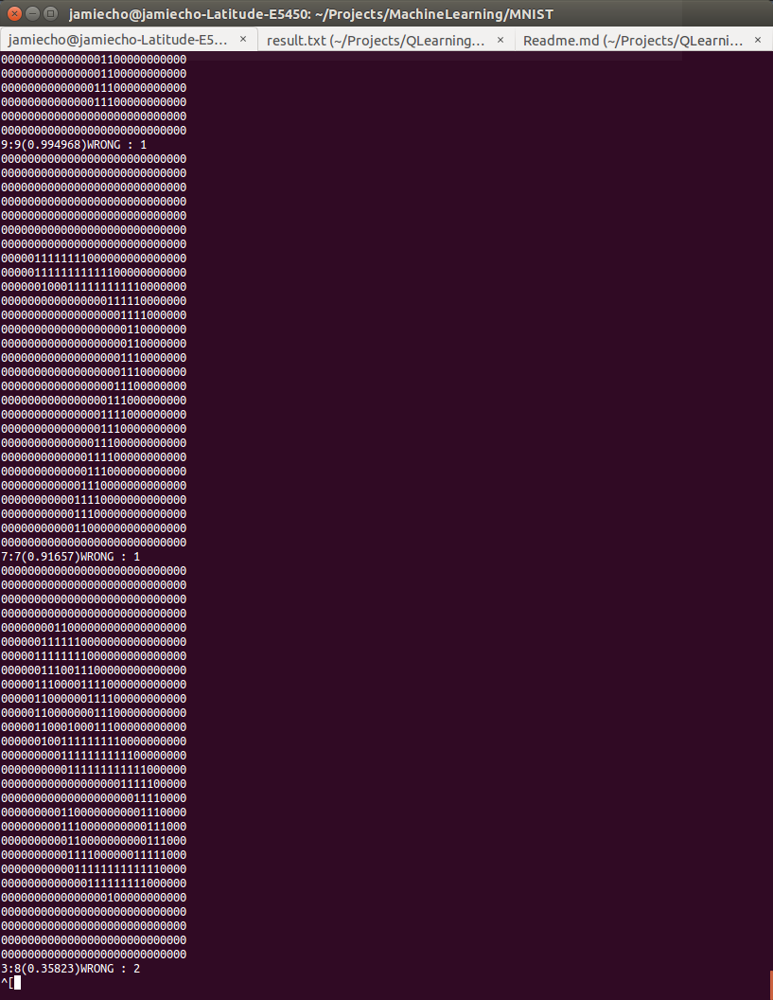

# MNIST Digit Recognition

#Works:

## Implementation

- [x] Machine-Learning Classification
- [x] Parsing MNIST data
- [x] Save/Load Trained Network
- [x] Visual Representation

## Refactoring code

- [ ] Remove parsing logic from framework
- [ ] Better define Globals (perhaps a different header)

## Logic
- [ ] Heuristic for determining eta / alpha values
